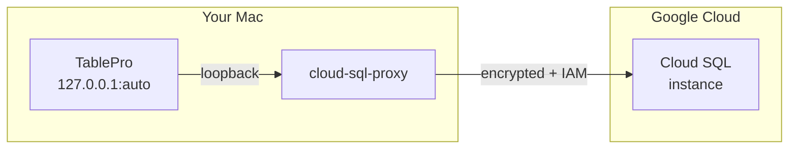

# Cloud SQL Auth Proxy

The [Cloud SQL Auth Proxy](https://cloud.google.com/sql/docs/mysql/sql-proxy) connects to a Google Cloud SQL instance over an encrypted, IAM-authorized channel without exposing the database to the public internet or managing client certificates. Instead of running `cloud-sql-proxy` by hand in a terminal before every session, TablePro starts it when you connect and stops it when you disconnect, the same way it manages [SSH tunnels](/databases/ssh-tunneling) and [Cloudflare tunnels](/databases/cloudflare-tunnel).

This works for Cloud SQL instances running MySQL, PostgreSQL, or SQL Server.

## How it works



TablePro picks a free loopback port, runs `cloud-sql-proxy --port <port> --address 127.0.0.1 <instance>`, waits until the local port accepts connections, then points the database driver at it. When you disconnect, quit the app, or the process exits, the proxy is torn down.

## Prerequisites

Install the proxy, or let TablePro download it for you (see the binary options below).

```bash
brew install cloud-sql-proxy
```

You also need credentials that can reach the instance, and the account needs the **Cloud SQL Client** role (`roles/cloudsql.client`).

## Setting up

Open the connection form, switch to the **Cloud SQL Auth Proxy** pane, toggle **Enable Cloud SQL Auth Proxy** on, enter the **instance connection name**, choose how to authenticate, then go back to **General** and click **Test Connection**.

Keep SSL/TLS off in the SSL pane. The proxy already encrypts the connection to Cloud SQL, and the local endpoint is plain loopback.

A connection uses one connection method at a time. If an SSH or Cloudflare tunnel is enabled, the pane offers to turn it off.

## Options

### Cloud SQL instance

| Field | Description |
|-------|-------------|
| **Instance connection name** | The instance's connection name in the form `project:region:instance`. Find it on the instance overview page in the Google Cloud console. |

### Authentication

| Option | Description |
|--------|-------------|
| **Application Default Credentials** | Uses the credentials already set up on your Mac. Run `gcloud auth application-default login` before connecting. Setting `GOOGLE_APPLICATION_CREDENTIALS` also works, but only if the variable is visible to TablePro: the proxy inherits the app's environment, and a GUI app doesn't see variables exported in your shell profile. |
| **Service account key** | Paste a service account key in JSON. TablePro stores it in the macOS Keychain and writes it to a temporary file, readable only by you, while the proxy runs. It is never passed on the command line. |
| **Use IAM database authentication** | Signs in to the database as an IAM principal instead of with a database password. Set the connection's username to the IAM principal (a user email, or `name@project.iam` for a service account). The database password is not used. |

### Network

| Option | Description | Default |
|--------|-------------|---------|
| **Connect over private IP** | Use the instance's private IP address instead of its public IP. | Off |

### Local listener

| Option | Description | Default |
|--------|-------------|---------|
| **Choose port automatically** | TablePro picks a free loopback port. Avoids collisions between connections and with local databases. | On |
| **Local port** | Set a fixed port instead. | - |

### cloud-sql-proxy binary

Leave the path blank to auto-detect. TablePro looks on your `PATH`, in the common Homebrew locations, and in the Google Cloud SDK's `bin` directory. If it isn't found, use **Download cloud-sql-proxy** or **Choose** to point at a specific binary.

The in-app download fetches cloud-sql-proxy 2.23.0 and verifies its SHA-256 checksum for your CPU architecture before installing it, so you always know which version you are running.

## Troubleshooting

### cloud-sql-proxy not found

Install it with `brew install cloud-sql-proxy`, download it from the pane, or set the binary path. A GUI app doesn't see your shell's `PATH`, so a custom install location may need to be set explicitly.

### Permission or authentication errors

The proxy reports authentication problems on its own output, which TablePro shows when a connection fails. Common causes: the account is missing the **Cloud SQL Client** role, Application Default Credentials aren't set up, or, for IAM database authentication, the database user hasn't been created for the IAM principal.

### Proxy didn't become ready

TablePro waits up to 30 seconds for the local port to accept connections. If it times out, the last lines of the proxy's output are shown. Check the instance connection name and that the account can reach the instance.
