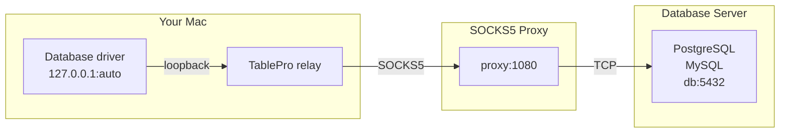

# SOCKS Proxy

SOCKS Proxy routes your database connection through a SOCKS5 proxy server. Use it when the database is only reachable through a corporate proxy, a bastion running `ssh -D`, or another SOCKS5 endpoint.

## How it works

TablePro opens a loopback listener on a free port and relays every connection through the proxy to the database, then points the driver at the local port. Unlike Cloudflare Tunnel and Cloud SQL Auth Proxy, there is no external binary to install: TablePro's own networking stack (Network.framework) speaks SOCKS5 directly.

The database hostname is sent to the proxy and resolved there, not on your Mac. This is remote DNS (what a `socks5h://` URL selects in other clients), and TablePro always does it, so there is no separate `socks5` mode that resolves locally. Hostnames that only resolve inside the private network behind the proxy work, and no DNS query for the database host leaves your machine.

## Setting up

The SOCKS Proxy pane appears for the same databases that support SSH tunneling. SQLite and cloud-managed databases like BigQuery, DynamoDB, and Snowflake don't show it.

Open the connection form, switch to the **SOCKS Proxy** pane, toggle **Enable SOCKS Proxy** on, enter the proxy **host** and **port**, then go back to **General** and click **Test Connection**.

A connection uses one connection method at a time. If the SSH Tunnel, Cloudflare Tunnel, or Cloud SQL Auth Proxy is enabled, the pane offers to turn it off.

## Options

| Field | Description | Default |
|-------|-------------|---------|
| **Host** | The SOCKS5 proxy server address. | - |
| **Port** | The proxy port. | 1080 |
| **Username** | Optional. Set it when the proxy requires username and password authentication. | - |
| **Password** | Optional. Stored in the macOS Keychain. | - |

<Tip>
An SSH dynamic port forward is a SOCKS5 proxy. Run `ssh -D 1080 user@bastion` in a terminal, then set the proxy host to `127.0.0.1` and the port to `1080`.
</Tip>

## Troubleshooting

### Timed out connecting through the proxy

TablePro waits 15 seconds for the path through the proxy to come up. A timeout means the proxy did not answer, the credentials were rejected, or the proxy could not reach the database. Check the proxy host and port, verify the username and password, and confirm the database host and port are reachable from the proxy's network.

### Local Network permission prompt

On macOS 15 and later, connecting to a proxy on your local network (a `192.168.x.x` address, for example) triggers the one-time Local Network permission alert. Allow it, or the proxy is unreachable. Loopback proxies like `ssh -D` on `127.0.0.1` don't trigger the prompt.

### The database rejects the connection

The proxy path is working but the database refused the connection. The driver's own error is shown, the same as connecting directly. Check credentials, SSL settings, and that the database allows connections from the proxy's address.
