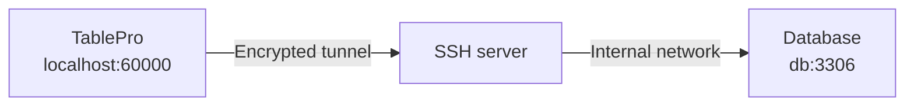

# SSH Tunneling

TablePro tunnels database connections through SSH using a built-in libssh2 client. No `ssh` binary or external setup is required. The tunnel opens a local forwarding port in the 60000-65000 range (this is why macOS may show a network permission prompt), sends a keep-alive every 30 seconds, and reconnects automatically if the tunnel dies.

The **SSH Tunnel** pane appears only for databases whose driver supports it. Databases reached through a file path or an HTTP API (SQLite, LibSQL, Beancount, BigQuery, Cloudflare D1, DynamoDB, Elasticsearch, Snowflake) do not show it.

## Setting Up

1. Open the connection form and switch to the **SSH Tunnel** pane
2. Toggle **Enable SSH Tunnel** on
3. Fill in **SSH Host**, **SSH Port** (default 22), and **SSH User**
4. Pick an authentication method
5. Back on **General**, click **Test Connection**

<Frame caption="SSH tunnel configuration">
  
  
</Frame>

<Note>
The database **Host** and **Port** on the General pane are what the SSH server uses to reach the database, not what your Mac would use. Use `localhost` if the database runs on the SSH server itself, or the internal hostname (for example an RDS endpoint reached through a bastion) if it runs elsewhere.
</Note>

To reuse one SSH config across several connections, save it as a profile with **Save Current as Profile...** or pick one from the **Profile** picker. See [SSH Profiles](/features/ssh-profiles).

## Authentication Methods

<Tabs>
  <Tab title="Password">
    Enter your SSH password in the **Password** field. Prefer keys for production servers.
  </Tab>
  <Tab title="Private Key">
    | Field | Description |
    |-------|-------------|
    | **Key File** | Path to your private key. Click **Browse** to pick one. |
    | **Passphrase** | Key passphrase, if the key is encrypted |

    Leave **Key File** empty to auto-detect the key from `~/.ssh/config` and default key locations.
  </Tab>
  <Tab title="SSH Agent">
    Signing is delegated to an agent process; TablePro never reads the key. The **Agent Socket** picker offers:

    - **SSH_AUTH_SOCK**: the system `SSH_AUTH_SOCK` environment variable
    - **1Password**: 1Password's socket at `~/Library/Group Containers/2BUA8C4S2C.com.1password/t/agent.sock`
    - **Custom Path**: any other agent socket path (Secretive, custom `ssh-agent`)
  </Tab>
  <Tab title="Keyboard Interactive">
    Sends your password through SSH's keyboard-interactive challenge-response. Use this when the server rejects plain password auth, which is common with PAM-based setups.
  </Tab>
</Tabs>

### Two-Factor Authentication (TOTP)

When the auth method is **Password** or **Keyboard Interactive**, a **Two-Factor Authentication** section appears for servers that require TOTP codes (PAM modules like `google-authenticator` or `duo_unix`):

- **Prompt at Connect**: TablePro asks for the code each time you connect.
- **Auto Generate**: TablePro computes the code from your base32 **TOTP Secret** (the key from your authenticator enrollment). Algorithm (SHA1, SHA256, SHA512), digits (6 or 8), and period (30s or 60s) are configurable; defaults match most setups.

## Host Keys

On first connection TablePro shows the server's key type and SHA-256 fingerprint (same format as `ssh-keygen -l`) and asks whether to trust it. Trusted keys are stored in `~/Library/Application Support/TablePro/known_hosts`.

If a trusted server's key changes, TablePro shows a warning with the old and new fingerprints. **Disconnect** is the default button; choose **Connect Anyway** only if you know the server was reinstalled. With jump hosts, every hop's key is verified.

## Using ~/.ssh/config

If `~/.ssh/config` has Host entries, a **Config Host** picker appears above the SSH Host field. Pick an alias and TablePro resolves `HostName`, `User`, `Port`, `IdentityFile`, `IdentityAgent`, and `ProxyJump` from the config at connect time. Values you type in the form override the config. The file is re-read whenever it changes, including `Include`d files.

<Frame caption="Picking a host from ~/.ssh/config">
  
  
</Frame>

## Jump Hosts

When the database sits behind one or more bastions, expand the **Jump Hosts** section and add each intermediate host in order. TablePro chains the hops in-process: each hop is an SSH session tunneled through the previous one, no `ssh` subprocess involved.

| Field | Description |
|-------|-------------|
| **Host** | Hostname or IP of the jump host |
| **Port** | SSH port (default 22) |
| **Username** | SSH username for this hop |
| **Auth** | **Private Key** or **SSH Agent** |
| **Key File** | Path to private key (Private Key auth only) |

Password auth is not available for jump hosts. If the jump host list is empty and the SSH host matches a config entry with a `ProxyJump` directive, TablePro follows it.

## Import from URL

Paste a `scheme+ssh://` URL to create a connection with SSH pre-filled. The `+ssh` suffix works with any non-file-based scheme (`mysql+ssh`, `postgres+ssh`, `redis+ssh`, `mongodb+ssh`, ...). TablePlus SSH URLs import directly. See the [Connection URL Reference](/databases/connection-urls#ssh-tunnel-format) for the format and parameters.

## Troubleshooting

**Tunnel connects but the database fails**: the database host is resolved from the SSH server, not your Mac. Verify it from the server: `ssh user@server "nc -z db-host 5432"`. Also check that the database credentials differ from the SSH ones where they should.

**Tunnel drops on idle networks**: TablePro already sends a libssh2 keep-alive every 30 seconds plus OS-level TCP keep-alives. If tunnels still drop, check the server's `ClientAliveInterval` and idle timeouts on firewalls or load balancers in between.

**Firewall prompt on connect**: TablePro listens on a local port between 60000 and 65000 for the tunnel. Allow it.

**SSH itself fails**: test the same host, user, and key in Terminal with `ssh -v user@server`. If that fails, the problem is server-side, not TablePro.
