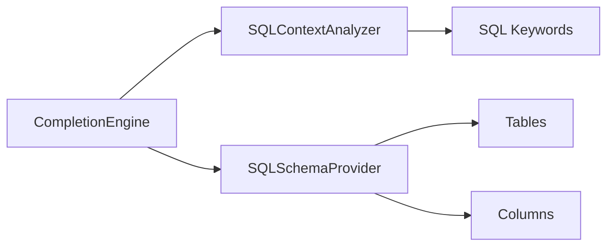
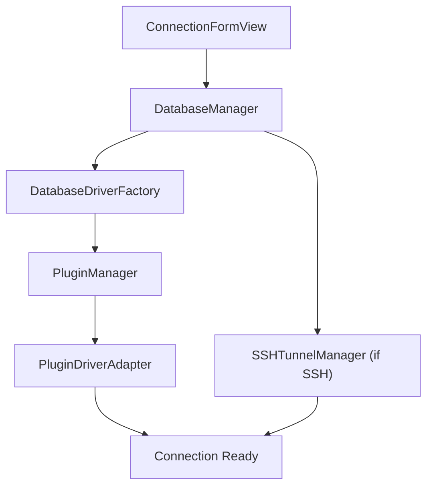
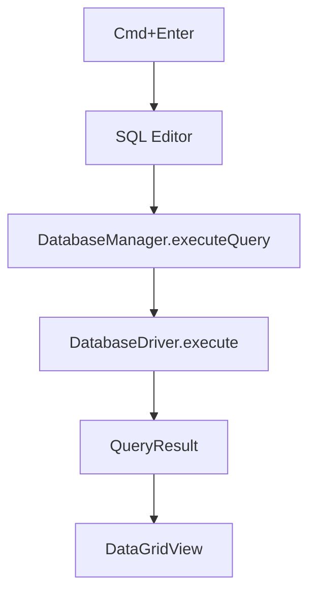

# Architecture

TablePro is built with:

- **SwiftUI** for the UI layer
- **AppKit** for low-level macOS integration (windows, menus, native tabs)
- **Swift Concurrency** (async/await, actors) for all async work
- **Native C libraries** for database connectivity, linked as static `.a` files

## Design Patterns

### MVVM

- **Models**: structs (value types, Codable)
- **ViewModels**: `@Observable` classes
- **Views**: SwiftUI, with AppKit bridging where needed

### Protocol-Oriented Drivers

All database connectivity goes through one protocol:

```swift
protocol DatabaseDriver: AnyObject {
    func connect() async throws
    func disconnect()
    func execute(query: String) async throws -> QueryResult
    func fetchTables() async throws -> [TableInfo]
    // ...
}
```

No switch statements on database type. No hardcoded driver list. Plugins register themselves, and the factory resolves them by `DatabaseType.pluginTypeId`. `DatabaseType` is a string-based struct, not an enum, so unknown types from future plugins stay valid.

### Actor Isolation

Thread-safe shared state uses Swift actors:

```swift
actor SSHTunnelManager {
    private var tunnels: [UUID: SSHTunnel] = [:]
    func createTunnel(connectionId: UUID, ...) async throws -> Int { ... }
}
```

## Dependencies

| Package | Source | Purpose |
|---------|--------|---------|
| CodeEditSourceEditor | Vendored in `LocalPackages/` (with CodeEditTextView, CodeEditLanguages) | Tree-sitter code editor |
| Sparkle | SPM, 2.9.0 | Auto-update with EdDSA signing |
| OracleNIO | SPM, TablePro fork pinned by revision | Oracle wire protocol for OracleDriverPlugin |

## Plugin System

All database drivers are `.tableplugin` bundles loaded at runtime. This keeps the app binary small and makes adding new databases a matter of dropping in a bundle.

| Component | Location | Role |
|-----------|----------|------|
| TableProPluginKit | `Plugins/TableProPluginKit/` | Shared framework with `DriverPlugin` and `PluginDatabaseDriver` protocols |
| PluginManager | `Core/Plugins/PluginManager.swift` | Discovers, loads, version-checks plugin bundles |
| PluginDriverAdapter | `Core/Plugins/PluginDriverAdapter.swift` | Bridges `PluginDatabaseDriver` to core `DatabaseDriver` |
| DatabaseDriverFactory | `Core/Database/DatabaseDriver.swift` | Resolves `DatabaseType` to loaded plugin |

### Driver Plugins

Five driver plugins ship inside the app bundle:

| Plugin | Database types | Connectivity |
|--------|---------------|--------------|
| MySQLDriverPlugin | MySQL, MariaDB | CMariaDB (libmariadb) |
| PostgreSQLDriverPlugin | PostgreSQL, Redshift, CockroachDB | CLibPQ (libpq) |
| SQLiteDriverPlugin | SQLite | System sqlite3 |
| ClickHouseDriverPlugin | ClickHouse | HTTP (URLSession) |
| RedisDriverPlugin | Redis | CRedis |

The app bundle also carries non-driver plugins: CSVInspectorPlugin, export plugins (CSV, JSON, SQL, XLSX, MQL), and import plugins (CSV, JSON, SQL).

The remaining 14 driver plugins are downloaded on demand from the [plugin registry](/development/plugin-registry):

| Plugin | Database types | Connectivity |
|--------|---------------|--------------|
| MongoDBDriverPlugin | MongoDB | CLibMongoc |
| OracleDriverPlugin | Oracle | OracleNIO (SPM fork) |
| DuckDBDriverPlugin | DuckDB | CDuckDB |
| MSSQLDriverPlugin | SQL Server | CFreeTDS |
| CassandraDriverPlugin | Cassandra, ScyllaDB | CCassandra |
| EtcdDriverPlugin | Etcd | HTTP (gRPC-gateway JSON) |
| CloudflareD1DriverPlugin | Cloudflare D1 | HTTP (URLSession) |
| DynamoDBDriverPlugin | DynamoDB | HTTP with hand-rolled SigV4 request signing |
| BigQueryDriverPlugin | BigQuery | REST (URLSession) |
| SnowflakeDriverPlugin | Snowflake | REST (URLSession) |
| LibSQLDriverPlugin | LibSQL, Turso | Hrana over HTTP, plus a local SQLite backend |
| ElasticsearchDriverPlugin | Elasticsearch | REST (URLSession) |
| SurrealDBDriverPlugin | SurrealDB | HTTP RPC with CBOR encoding |
| BeancountDriverPlugin | Beancount | Ledger file parsing, optional Python projection |

### PluginKit ABI

TableProPluginKit builds with Swift Library Evolution (`BUILD_LIBRARY_FOR_DISTRIBUTION = YES`), so its public ABI is resilient. Plugins built against an older PluginKit keep loading under a newer app: the runtime fills unimplemented protocol requirements from their defaults.

Additive changes (a new requirement with a default implementation, a new field added through a new initializer overload) need no version bump. Breaking changes bump `currentPluginKitVersion` (18 as of 0.57.0) in `PluginManager.swift`, and the loader then rejects mismatched plugins cleanly. Run `scripts/check-pluginkit-abi.sh` before merging any change under `Plugins/TableProPluginKit/`. See [Plugin Development](/development/plugin-development) for the full rules.

### Opt-in Plugin Protocols

Plugins can adopt protocols beyond `PluginDatabaseDriver` to expose extra capabilities. These are runtime-cast (`as?`), so plugins that do not conform keep working without an ABI bump.

| Protocol | Purpose |
|----------|---------|
| `PluginDiagnosticProvider` | Provide a user-facing diagnostic for driver errors |
| `PluginProcedureFunctionSupport` | Expose stored procedures and functions in the structure tab |
| `PluginDefaultSortProvider` | Override default-sort behavior per table: `.useAppDefault`, `.suppress`, or `.forceColumns([String])` |

## Key Components

### DatabaseManager

Connection pool and lifecycle management. Primary interface between UI and drivers. Handles connect, disconnect, reconnect, and session tracking.

### ConnectionHealthMonitor

Pings active connections every 30 seconds. Auto-reconnects with exponential backoff on failure.

### Change Tracking

1. A cell edit is recorded by `DataChangeManager` as a pending change
2. Save runs `SQLStatementGenerator`, which turns pending changes into INSERT, UPDATE, and DELETE statements
3. Undo/redo goes through the window's `UndoManager`, registered by `DataChangeManager`
4. `AnyChangeManager` wraps the concrete manager behind the `ChangeManaging` protocol

### MainContentCoordinator

The central coordinator for the main window. It is split across extension files in `Views/Main/Extensions/` (`MainContentCoordinator+Alerts`, `+Filtering`, `+Pagination`, and so on). New coordinator functionality goes in a new extension file, not the main file.

### Autocomplete Engine



- **CompletionEngine**: entry point, produces ranked suggestions
- **SQLContextAnalyzer**: parses cursor position context (table ref, column ref, keyword)
- **SQLSchemaProvider**: actor that caches and serves schema data

### MCP Server

The MCP server lives under `Core/MCP/`, layered from wire types up: Codable JSON-RPC 2.0 and SSE types, transports (an `NWListener` HTTP server bound to `127.0.0.1` plus a stdio bridge for the `tablepro-mcp` CLI), actor-based session, auth, and rate-limit stores, and a protocol dispatcher that runs each inbound request in its own task. Sessions expire after 15 minutes idle. The dispatcher serves 19 tools and accepts protocol versions `2025-03-26`, `2025-06-18`, and `2025-11-25`. See the [tool catalog](/external-api/mcp-tools) and [Versioning](/external-api/versioning).

## Data Flow

### Connection



### Query Execution



## State Management

| Pattern | What | Where |
|---------|------|-------|
| `@Observable` | UI state, sessions, active tab | ViewModels |
| `@AppStorage` | User preferences | Settings |
| Keychain | Connection passwords | ConnectionStorage |
| SQLite FTS5 | Query history (full-text search) | QueryHistoryStorage |
| JSON files | Tab state persistence | TabStateStorage |

For the repository layout, see [Project Structure](/development/setup#project-structure).
