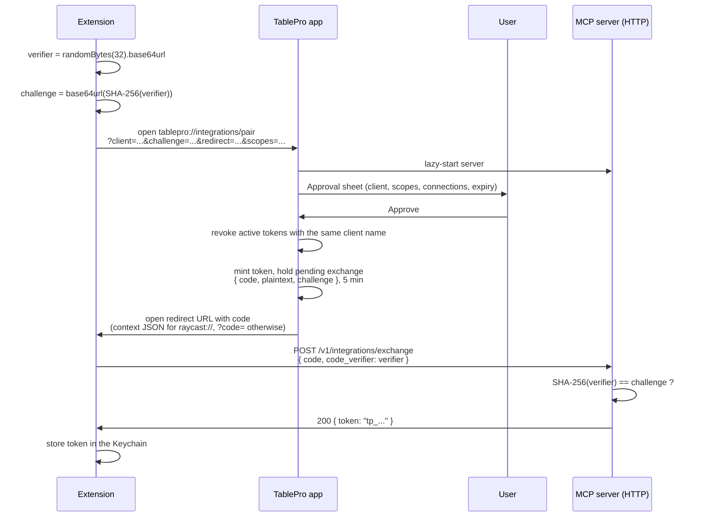

# Pairing

Pairing is how an extension gets a TablePro token without the user copying one by hand. The extension opens a `tablepro://integrations/pair` deep link, the user approves scopes and connections in TablePro, and the extension exchanges a one-time code for the token over localhost HTTP.

The flow is PKCE-style: the extension generates a verifier, hashes it into a challenge, and TablePro releases the token only to the caller that presents the verifier. An app that intercepts the redirect cannot exchange the code.

## Sequence



<Frame caption="The pairing approval sheet">
  
  
</Frame>

## Extension steps

### 1. Generate a verifier and challenge

```ts
import { randomBytes, createHash } from "node:crypto";

function base64url(buffer: Buffer): string {
  return buffer.toString("base64").replace(/\+/g, "-").replace(/\//g, "_").replace(/=+$/, "");
}

const verifier = base64url(randomBytes(32));
const challenge = base64url(createHash("sha256").update(verifier).digest());
```

Keep the verifier in memory until the exchange step. Do not log it.

### 2. Open the pair deep link

Open `tablepro://integrations/pair?client=...&challenge=...&redirect=...&scopes=...`. Parameters are documented in the [URL scheme reference](/external-api/url-scheme#start-pairing).

### 3. Receive the code and exchange it

TablePro opens your `redirect` URL with a one-time code. For `raycast://` redirects the code arrives as `?context={"code":"<uuid>"}` (Raycast's launch-context convention); for any other scheme it is a flat `?code=<uuid>` query parameter. An `error` parameter instead of a code means the user denied the request; stop and show the description.

Read the MCP port from `~/Library/Application Support/TablePro/mcp-handshake.json`, then:

```ts
const port = await readHandshakePort();
const res = await fetch(`http://127.0.0.1:${port}/v1/integrations/exchange`, {
  method: "POST",
  headers: { "Content-Type": "application/json" },
  body: JSON.stringify({ code, code_verifier: verifier }),
});
const { token } = await res.json();
```

The exchange endpoint requires no bearer auth. The single-use code plus the verifier is the auth.

### 4. Store the token

Store the token in the macOS Keychain. In Raycast, write it to a password preference, which is Keychain-backed. Do not keep it in `LocalStorage` or plain files.

## What TablePro does on approval

The approval sheet shows the client name, a scope picker (defaults to the requested scope, downgradeable), a connections multi-select (defaults to all unless `connection-ids` was provided), and an expiry picker (defaults to never). The query parameters are a request, not a grant.

On approve, TablePro:

1. Revokes any existing active token with the same client name. An extension that pairs again must replace its stored token; the old one stops working the moment the user approves.
2. Mints the token and holds the plaintext in memory as a pending exchange keyed by a UUID code, valid for 5 minutes. Only the SHA-256 hash plus salt reaches `mcp-tokens.json`.
3. Opens the `redirect` URL with the code.

At most 50 exchange codes can be pending at once. Beyond that, new pair requests fail until older codes expire.

## Security properties

| Property | How |
|----------|-----|
| Token is never in a URL | The token travels over localhost HTTP, not in a deep link. |
| Redirect interception is harmless | The intercepted `code` cannot be exchanged without the verifier. |
| Code is single-use | Successful exchange or 5-minute expiry deletes the pending exchange. |
| Plaintext token is not persisted by TablePro | Only the SHA-256 hash plus salt is saved to `mcp-tokens.json`. |
| User sees and approves scopes | The sheet shows what was requested, what is granted, and which connections. |
| User can revoke any time | **Settings > Integrations > Authentication > Revoke**. |

## Errors

| Code | Meaning |
|------|---------|
| `403 Challenge mismatch` | The verifier does not hash to the stored challenge. |
| `404 Pairing code not found` | The code does not exist or was already exchanged. |
| `410 Pairing code expired` | The pending exchange is older than 5 minutes. |

A failed exchange is recorded in the activity log under the `auth` category with outcome `denied`.

If the user clicks **Deny**, TablePro opens the `redirect` URL with `error=denied` and `error_description=user_denied`, wrapped in the `context` JSON for `raycast://` redirects and appended as flat query parameters otherwise.

## Implementing pairing in another extension

The flow is not Raycast-specific. Any client that can receive a callback can use it:

1. Generate a verifier and challenge.
2. Open `tablepro://integrations/pair?...` with a callback URL the OS can route back to you.
3. Read the MCP port from the handshake file.
4. POST `{ code, code_verifier }` to `/v1/integrations/exchange`.
5. Store the returned token in the Keychain.

If the client cannot register a custom URL scheme, run a localhost HTTP server on a chosen port and pass `http://127.0.0.1:<port>/callback` as the `redirect`.
